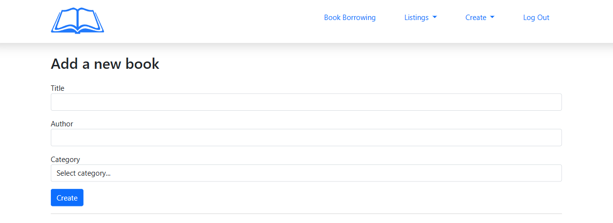

## For library admin

There is an admin login page
http://library-management-sys.atwebpages.com/admin/login 
#### Use:
```email: admin@admin.com ```
```password: password```

#### Admin can: 

* view the current library status: the number of students, books and overdue books
* add, edit, view and delete books 
* create a student account (and generate a unique password)
* assign/ unassign a book to a student

## For students
There is a user login page
http://library-management-sys.atwebpages.com/user/login
#### Use:
```email: student1@test.com ```
```password: password```

#### Students can:
* browse all books and their availability

#### In student dashboard, they can view: 
* their checked out books
* their status with the library

## General
* Books can be searched by title, author and category.
* There is pagination for lists.
* Lists can be sorted by name.
* You can view all books and their current status (available/ borrowed).
* Once a book is borrowed, if it is not returned within 14 days, a "BOOK OVERDUE" message appears in the dashboard of the student who borrowed the book.

 
 

 


 

 
 
 


 